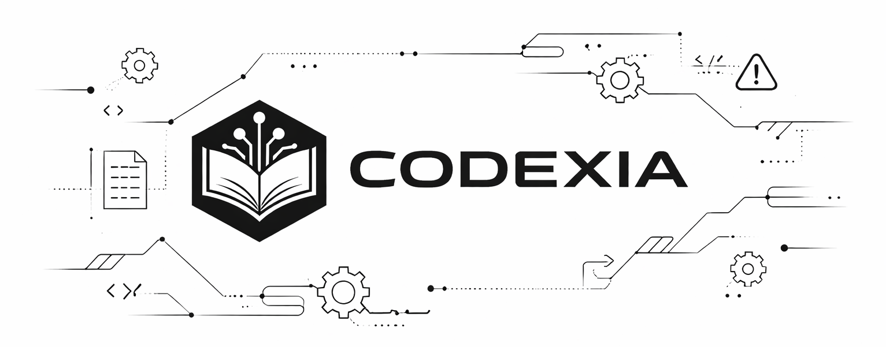

# Codexia



**Engineering intelligence layer for repositories and AI coding agents.**

Codexia understands your codebase, its history, its architecture, and its rules—and produces evidence-based insight, not guesses.

---

## Quick Start

```bash
npm install -g codexia
cd /path/to/repo
codexia analyze
codexia status
```

That is the shortest path to a first local scan and health check. `codexia analyze` and `codexia status` operate on the current working directory, so `cd` into the repository you want to inspect first.

## Choose Your Path

- Local CLI: use `codexia analyze`, `codexia update`, `codexia impact`, and related workflows from the [CLI Guide](docs/cli.md).
- MCP or editor setup: connect Codexia to your assistant or editor with the [MCP Tools](docs/MCP.md) guide.
- Dashboard from source: run the local analytics UI from a repo checkout or source build with the [Dashboard Guide](docs/dashboard.md). The dashboard is not shipped in the published npm package.

## Product Layers

- Core: local repository intelligence built from your checkout.
- Integrations: MCP and optional AI assistance.
- Operations: dashboard engineering analytics, plus GitHub and Jira analytics when configured.

## Optional Integrations

Codexia works without optional integrations. Add only the layers you need:

- Integrations: MCP client setup for editor or agent workflows [MCP Tools](docs/MCP.md), plus AI provider setup for local Ollama or remote providers [AI Guide](docs/ai.md).
- Operations: dashboard source-run analytics, including optional GitHub and Jira data and remote API calls when configured [Dashboard Guide](docs/dashboard.md).

## Documentation

- [Getting Started](docs/getting-started.md)
- [CLI Guide](docs/cli.md)
- [MCP Tools](docs/MCP.md)
- [Dashboard Guide](docs/dashboard.md)
- [AI Guide](docs/ai.md)
